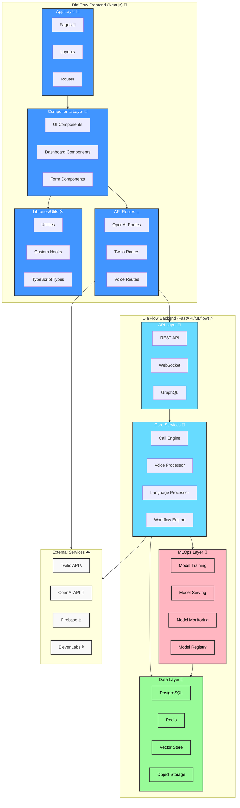

# DialFlow

DialFlow is an AI-powered voice agent platform that provides multilingual customer support through intelligent, automated phone interactions.

## Features

- **Multilingual Support**: Handles conversations in Darija, Arabic, French, and English with automatic language detection
- **Voice Integration**: 
  - Twilio integration for telephony services
  - ElevenLabs and OpenAI voice synthesis support
  - Custom voice profile creation and management
  
- **AI Capabilities**:
  - Natural language processing for contextual understanding
  - Automated task handling and workflow management
  - Real-time language translation
  - Voice-to-text and text-to-voice conversion

- **Enterprise Features**:
  - CRM system integration
  - End-to-end encryption
  - GDPR compliance options
  - Customizable data retention policies
  - Real-time analytics and monitoring

## Technical Stack

### Frontend
- Next.js 14.2.16
- TypeScript
- TailwindCSS
- shadcn/ui components
- Radix UI primitives

### Backend Integrations
- Twilio for telephony
- OpenAI for speech processing
- ElevenLabs for voice synthesis
- Firebase for authentication and data storage

### Key Dependencies
- `openai`: OpenAI API integration
- `twilio`: Telephony services
- `firebase`: Authentication and database
- `zod`: Schema validation
- `date-fns`: Date utilities
- `lucide-react`: Icon system

## Project Structure

```
dialflow/
├── app/                    # Next.js application routes
│   ├── api/               # API routes
│   ├── dashboard/         # Dashboard pages
│   └── layout.tsx         # Root layout
├── components/            # React components
│   ├── dashboard/         # Dashboard-specific components
│   └── ui/               # Shared UI components
├── lib/                   # Utilities and shared code
├── public/               # Static assets
└── styles/              # Global styles
```




## Getting Started

1. Clone the repository:
```bash
git clone https://github.com/IbLahlou/dialflow.git
```

2. Install dependencies:
```bash
cd dialflow_frontend
npm install
```

3. Configure environment variables:
Create a `.env.local` file with the following:
```env
OPENAI_API_KEY=your_openai_key
TWILIO_ACCOUNT_SID=your_twilio_sid
TWILIO_AUTH_TOKEN=your_twilio_token
TWILIO_PHONE_NUMBER=your_twilio_number
FIREBASE_CONFIG=your_firebase_config
```

4. Run the development server:
```bash
npm run dev
```

## Configuration

### Voice Provider Setup

The platform supports two voice providers:
- ElevenLabs
- OpenAI

Configure the voice settings in the dashboard under agent settings.

### Telephony Setup

1. Configure Twilio webhook URLs in your agent settings
2. Set up phone numbers through the dashboard
3. Configure call handling workflows

### Security Configuration

Enable security features through the dashboard:
- End-to-end encryption
- GDPR compliance settings
- Data retention policies

## API Routes

The platform provides several API endpoints:

- `/api/openai`: Handles OpenAI interactions
- `/api/test-call`: Initiates test calls
- `/api/tts-preview`: Generates voice previews
- `/api/twilio-webhook`: Handles Twilio callbacks
- `/api/voices`: Manages voice configurations

## Development

### Code Style
- TypeScript for type safety
- ESLint for code linting
- Prettier for code formatting

### Build
```bash
npm run build
```

### Production
```bash
npm run start
```

## Security

- Implements encryption for sensitive data
- GDPR-compliant data handling
- Secure authentication through Firebase
- API key protection

## Contributing

1. Fork the repository
2. Create a feature branch
3. Commit your changes
4. Push to the branch
5. Create a Pull Request

## License

[MIT License](LICENSE)